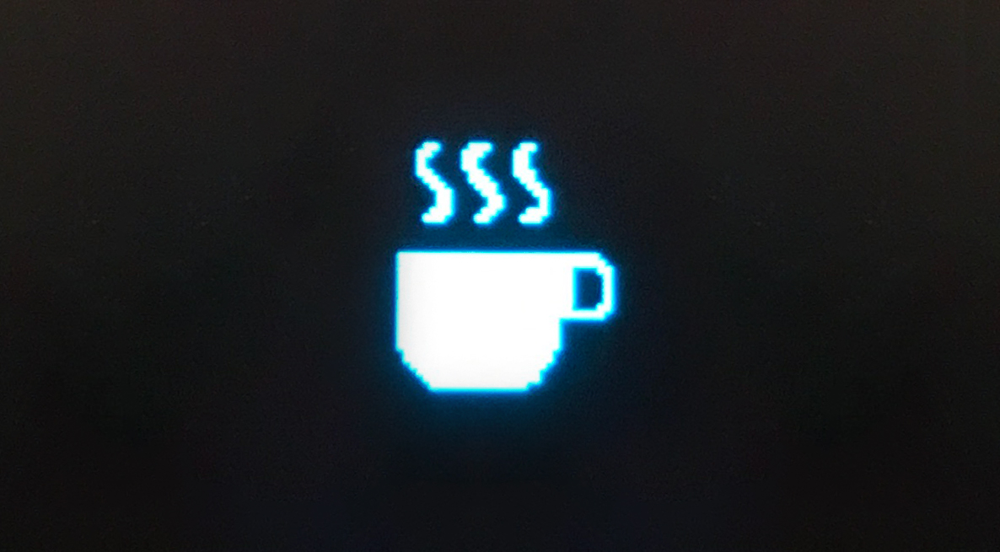
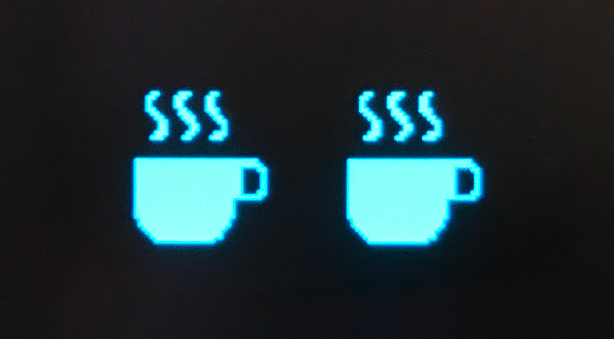
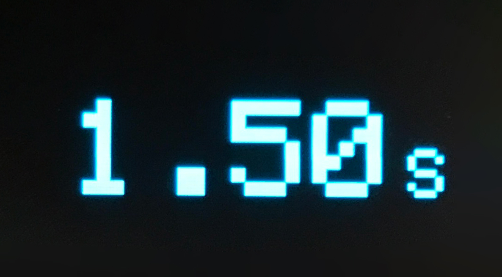
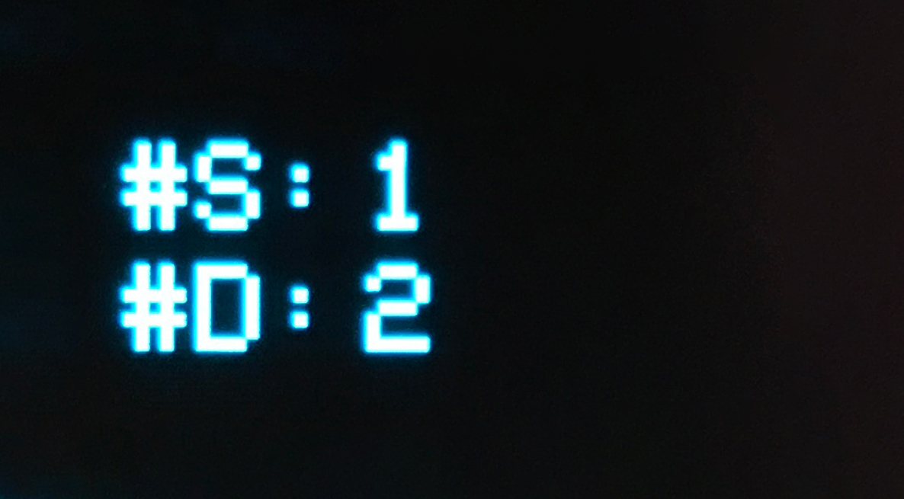
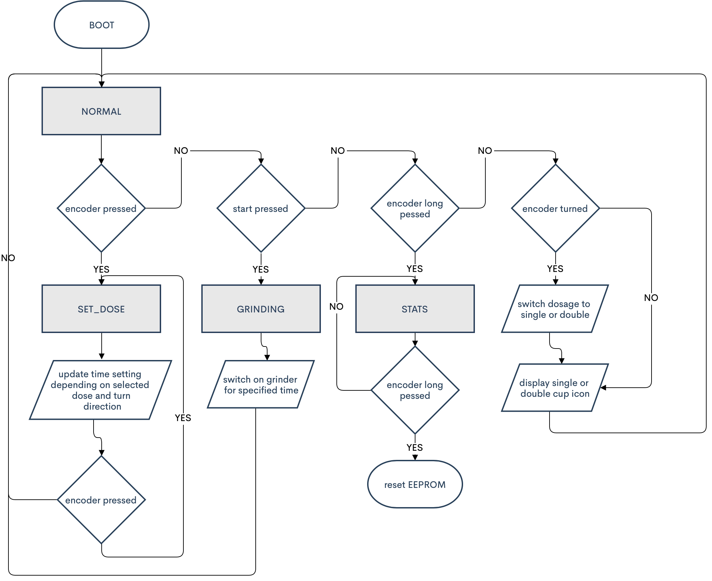

  
  <h3 align="center">Sophisticated Coffee Grinder Timer Firmware</h3> 
  

    
  
  

 

## About

This project is an advancement of my [7_Dollar_Coffee_Grinder_Timer](https://github.com/GatCode/7_Dollar_Coffee_Grinder_Timer) I developed a few years ago. As the time goes on, so does the need for a more sophisticated coffee grinder. Similar to what I stated in the corresponding [Instructable](https://www.instructables.com/id/The-7-Coffee-Grinder-Timer/), the aim of this firmware is to find a great coffee grinder with as much bang for your buck as possible and to customize it to your needs. This firmware is my way of achieving a more professional and reliable coffee grinder. You can find more information on the new [OpenGrind Instructable](https://www.instructables.com/The-14-Sophisticated-Coffee-Grinder-Timer/).

## Prerequisites

The getting started section below assumes that you are using the same hardware and configuration as stated in this [Instructable](https://www.instructables.com/The-14-Sophisticated-Coffee-Grinder-Timer/).

A shppinglist can be found und [Instructable](https://www.instructables.com/The-14-Sophisticated-Coffee-Grinder-Timer/) or [here]( https://github.com/Steffeeeen1234/OpenGrind/blob/master/assets/Shppinglist.png) is an image of the parts I bought today.

## Getting Started

Make sure you have installed [PlatformIO](https://platformio.org/platformio-ide) and know the basics on how to use it.

1. Open the *OpenGrind* Folder in VSCode

2. Choose the correct `upload_port`corresponing to your MCU and OS in the `platformio.ini`file. This can be for example`COM3`on Windows or`/dev/ttyUSB0`on Mac or Linux.

3. Connect your microcontroller and hit the upload button --> enjoy 🎉

## Usage

The first screen you see after booting is the default screen which contains the selection for the grinding dosage (one or two cup icons).

 

From there on you can choose the action to achieve the desired result.

| Desired Result                       | Action                                                                      | Possible Result                                              |
| ------------------------------------ | --------------------------------------------------------------------------- | ------------------------------------------------------------ |
| Switch between single or double dose | turn rotary encoder                                                         |  |
| Set grinding time for selected dose  | turn the rotary encoder while pressing it                                   |       |
| Start the grinder                    | press the start button                                                      |       |
| Show statistics                      | press and hold the rotary encoder for five seconds                          |      |
| Factory Reset                        | press and hold the rotary encoder for five seconds while in show statistics | reboot                                                       |

**Note for the statistics:** S stands for the number of single dosages you have ground with this grinder; likewise D stands for the number of ground double dosages.

## Customization

If you choose to alter the hardware configuration (IO pins) or you are not satisfied with the behavior of the firmware, you can find all major settings in the `src/Definitions.h`file.

## Basic Principle of the Firmware

This firmware operates on the principle of a state machine with 4 main states.

## Troubleshooting

During the first test runs, I quickly encountered the problem that the Arduino sometimes froze during the operation. This freezing occurred due to the electromagnetic interference (EMI) of the powerful electro motor inside the grinder. There are a lot of possibilities why this occurs but one possible solution is to connect the Arduino GND to mains earth. Keep in mind: a small wire connection to earth may not be sufficient! To achieve the best possible EMI reduction in my case, I had to enclose the whole Arduino in a metal housing (or wrap it with copper/aluminum tape), make the connection from the Arduino GND to the metal housing as short as possible and then connect the metal housing to the mains earth.

## Limitations

This App is provided as-is!
Please feel free to adapt it to your needs and contribute to the project. I would be very grateful to include your improvements. Thanks for your support!

**WARNING:** Everyone is responsible for what he/she is doing! I am not responsible if you hurt yourself, torch your house or anything that kind trying to build/improve your coffee grinder! You are doing everything at your own risk!
